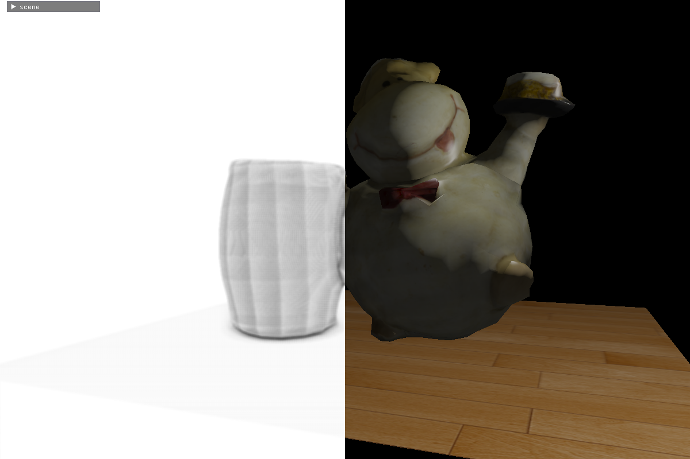

# OpenGL Demo

这是学习 OpenGL 时, 编写的例子.

1. **blinn-phong 着色模型**
   
2. **normal mapping 切线空间的法线贴图**
   
3. **parallax mapping 视差贴图**
   
4. **shadow mapping 定向光阴影映射**
   
5. **point shadow 点光源阴影映射**
   
6. **pbr sphere 着色**
   
7. **IBL 环境光**
   
8. **deferred shading 延迟渲染**
   
9. **SSAO(screen space ambinet occlusion) 环境光遮蔽**
   

## Build

使用 **visual studio 2019** 构建. 部分使用到了 **C++20 特性**

直接使用 **vs2019 cmake** 构建. 

生成以后会在 `out/build/x64-Debug` 下生成 `exe` 文件. **运行时可能会找不到库文件.**

需要将 `assimp/lib` 下的三个库文件拷贝到 `out/build/x64-Debug` 后可以启动

## 使用

启动程序以后, 会看到下面的界面

这时候可以选择展示的 `demo`

每个 `demo` 都可 `scene` 和 `camera` 窗口. `w, s, a, d` 可以移动. 启动 `mouse` 可以使用鼠标变换视角.  也可以通过 拖动 `pitch` 和 `yaw` 的值. 来修改观察方向

